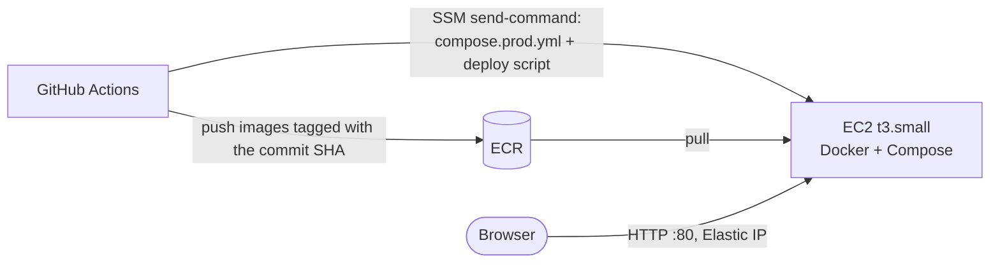

# Thumbnail Factory

A small app built to learn Docker and Docker Compose. You upload an image, a background worker makes
thumbnails, and the page shows each job moving from `queued` to `processing` to `done`.

The app is deliberately simple. Each of the five containers exists because the app needs it, so each
Docker concept shows up for a real reason: multi-stage builds, named volumes, networks, healthchecks,
restart policies, scaling, and dev/prod Compose files.

## Architecture


| Service | What it does |
|---------|--------------|
| `gateway` | nginx, the only container with a published port. It routes `/api` to the backend, `/` to the frontend, and serves thumbnails straight from the `media` volume. |
| `frontend` | The React app. In production-like mode it's built static files served by nginx; in dev mode it's the Vite dev server. |
| `backend` | FastAPI. It validates uploads, saves originals, queues jobs, and reports status. It's the only service on both networks. |
| `worker` | An RQ worker that takes jobs off the queue and writes WebP thumbnails at 128, 256, and 512 px. Scale it with `--scale worker=N`. |
| `redis` | The job queue and job status store. |

Design details are in [specs/design.md](specs/design.md), requirements in
[specs/requirements.md](specs/requirements.md), and the build plan in [specs/tasks.md](specs/tasks.md).

## Quick start

You need Docker with Compose v2 (Docker Desktop includes both). Nothing else: Python and Node run
inside the containers.

```sh
docker compose up --build
```

Open <http://localhost:8080> and drop in some images.

If port 8080 is already taken, choose another one:

```sh
GATEWAY_PORT=8081 docker compose up --build
```

## Two modes

| | Dev (default) | Production-like |
|---|---|---|
| Command | `docker compose up` | `docker compose -f compose.yml up` |
| Files | `compose.yml` + `compose.override.yml` (loaded automatically) | `compose.yml` only |
| Frontend | Vite dev server; React edits appear in the browser without a reload | Built static files on nginx |
| Backend | `uvicorn --reload` on your bind-mounted source | Code baked into the image |
| Worker | `watchfiles` restarts `rq worker` when code changes | `rq worker` |

The smoke test and CI use production-like mode, so they test what actually gets deployed.

## Everyday commands

```sh
docker compose ps                        # what's running, and health status
docker compose logs -f worker            # follow one service's logs
docker compose exec backend sh           # shell inside a container
docker compose exec redis redis-cli      # poke at Redis (keys: job:*, jobs:recent, rq:*)
docker compose up -d --wait              # start in the background; return once healthy
docker compose down                      # stop and remove containers (volumes are kept)
docker compose down -v                   # ...and delete the volumes (all data)
scripts/smoke_test.sh                    # end-to-end check through the gateway
```

## Learning experiments

Each experiment below was run on this stack; the output shown is what actually happened. Start the
stack first with `docker compose up -d --wait`. Commands assume the default port, 8080.

### 1. Scale the workers

```sh
docker compose up -d --scale worker=3
```

Upload 6 images at once. Each job card shows which worker processed it. In our run the 6 jobs were
split 2 per worker across 3 different workers. Three started at once, then the other three, so the
batch took about 4 s instead of 12 s.

**Why it works:** all workers read the same Redis queue, and each job goes to exactly one of them. The
`worker` service has no `container_name` and no published ports, which is what lets Compose run
several copies of it. The name on each card is the container's hostname (its short container ID).

### 2. Kill a worker in the middle of a job

```sh
WORKER_DELAY_SECONDS=30 docker compose up -d --wait   # slow jobs down
# upload an image, wait until its card says "processing", then:
docker compose kill worker
docker compose ps -a worker                           # Exited (137)
```

Keep watching the card. It stays `processing` for about 90 s, then switches to **failed: worker lost**
(94 s in our run).

**Why:** a killed worker can't record that it failed. RQ notices only when the worker's heartbeat
expires, which takes about 90 s. The API checks RQ each time it reports a `processing` job, so the UI
shows the failure soon after that. If it relied on RQ's own cleanup, which workers run every 10
minutes, the job would look stuck for much longer.

**Also notice:** the worker was *not* restarted, even though it has `restart: unless-stopped`. Docker
treats `docker compose kill` as you deliberately stopping the container, the same as
`docker compose stop`. Bring it back with `docker compose up -d`. Compare that with
`docker compose exec worker kill 1`, which makes the process exit on its own: Docker restarts that
container by itself.

**Dev-mode caveat:** in dev mode the container's main process is `watchfiles`, not `rq`. If `rq`
crashes, `watchfiles` keeps running, so the container stays `Up` and the restart policy never
applies. The worker's healthcheck catches this: it turns `(unhealthy)` about 30 s after the crash
(`docker compose ps`), and `up --wait` fails. But Compose never restarts an unhealthy container (only
Swarm and Kubernetes do), so restart it with `docker compose restart worker`. In production-like mode
`rq` *is* the main process, so a crash stops the container and the restart policy brings it back.

The crashed `rq` briefly becomes a **zombie**: dead, but still in the process table because its parent
(`watchfiles`) hasn't collected its exit status. A naive "is PID alive?" check (`kill -0`) says yes to
a zombie, so the healthcheck reads the process state from `/proc` instead (see
`backend/app/worker_health.py`).

### 3. `down` versus `down -v`

```sh
docker compose down && docker compose up -d --wait      # jobs and thumbnails are still there
docker compose down -v && docker compose up -d --wait   # everything is gone
```

In our run: 18 jobs and 69 files survived `down`; after `down -v` there were 0 of each.

**Why:** containers are disposable, and any data they write inside themselves disappears with them.
Uploads live in the `media` named volume and jobs in `redis-data` (Redis also saves its data to disk
there). `down` removes containers and networks but keeps volumes; `-v` deletes the volumes too.

### 4. Network isolation

```sh
docker compose exec gateway nc -zv -w 2 redis 6379     # nc: bad address 'redis'
docker compose exec backend python -c "import redis; print(redis.Redis(host='redis').ping())"   # True
```

**Why:** the gateway and frontend are on the `public` network; Redis and the worker are on `internal`.
Docker's built-in DNS only answers for services on the same network, so from the gateway the name
`redis` doesn't even exist. The backend is on both networks and is the only path between them.
`internal` is also marked `internal: true`, so nothing on it can reach the internet.

Before this split, everything shared one default network and the gateway could connect to Redis,
which has no password.

### 5. Image sizes and multi-stage builds

```sh
docker image ls "thumbnail-factory/*"
docker history thumbnail-factory/backend
```

| Backend image | Unpacked | Download |
|---------------|---------:|---------:|
| Debian `-slim`, one stage | 299 MB | 104 MB |
| Alpine, one stage | 200 MB | 84 MB |
| Alpine, two stages (current) | 117 MB | 36 MB |

The frontend shows the effect even more strongly: its Node build stage is 293 MB, and the image that
ships is 59 MB, of which the app itself is 270 KB.

**Why:** image layers only ever add files. Running `rm` in a later step doesn't shrink the image,
because the earlier layer still contains the file. A multi-stage build installs things in a throwaway
`builder` stage and copies only the result (`COPY --from=builder`) into a fresh image, so the build
tools never become part of what ships. The full breakdown is in
[specs/measurements.md](specs/measurements.md).

### 6. A broken dependency blocks startup

```sh
docker compose down
REDIS_URL=redis://redis:6390/0 docker compose up -d --wait   # wrong port on purpose
docker compose ps -a
```

```
backend    Up 31 seconds (unhealthy)
gateway    Created
redis      Up 32 seconds (healthy)
```

`up --wait` gives up after about 30 s with
`dependency failed to start: container thumbnail-factory-backend-1 is unhealthy`, and the gateway is
never started.

**Why:** the backend's healthcheck calls `/api/health`, which pings Redis. The gateway has
`depends_on: backend: condition: service_healthy`, so it waits for a healthy backend, not just a
running one. Without the condition, the gateway would start straight away and send users errors.
Run `docker compose down && docker compose up -d --wait` to recover.

### 7. CI catches what unit tests can't

CI (`.github/workflows/ci.yml`) runs three jobs on every pull request. `backend` and `frontend` run lint
and unit tests. `smoke` then builds every image, starts the production-like stack with
`up --wait`, and runs `scripts/smoke_test.sh` against it. `main` is protected: a PR can only merge
when all three pass.

To see why the smoke job matters, we opened a PR ([#1](https://github.com/shailrshah/thumbnail-factory/pull/1))
with a one-character mistake in `compose.yml`: the worker listens on `thumbnail` while the API
enqueues to `thumbnails`.

| Job | Result |
|-----|--------|
| backend | ✅ pass: every unit test is still green, because the Python code is fine |
| frontend | ✅ pass |
| smoke | ❌ `FAIL: job still 'queued' after 30s` |

The failure step printed the container logs, which pointed straight at the cause:
`worker-1 | *** Listening on thumbnail...`. GitHub showed the PR as **BLOCKED**.

**Why:** unit tests check pieces separately, and this bug lives in how the pieces are wired together.
The only way to catch it is to run the real containers together, which is what the smoke job does.
The images build with a per-image GitHub Actions cache: 21 s cold, 11 s warm.

### 8. Roll back a deployment

Every merge to `main` deploys images tagged with that commit's SHA, and ECR keeps the last 10 of
each image. To roll back, run the Deploy workflow by hand with an older SHA:

```sh
gh workflow run deploy.yml -f image_tag=<full-commit-sha>
```

What happened when we rolled back from `6945057` to `cfb5ad0`:

- The build steps were **skipped**, because those images were already in ECR. The job took 37 s.
- On the instance, `.env` and all four app containers switched to `cfb5ad0`.
- The job created before the rollback was **still there**. Rolling back replaces containers, but the
  `media` and `redis-data` volumes stay.
- Running the workflow again with `6945057` rolled forward, and the smoke test passed against
  production.

A mistyped SHA fails at the checkout step, before anything touches the instance. A real SHA whose
images the ECR lifecycle rule has deleted fails at *Check images exist for this tag*.

**Why rollback is this simple:** images are *immutable* and addressed by commit, and the deploy
checks out that commit's `compose.prod.yml`. So "deploy version X" always means exactly the same
images and the same Compose file, whether X is new or old.

## Deployment (AWS)

The same Compose stack runs on a single EC2 instance, so deploying adds to what you learned about
Compose rather than swapping in a different orchestrator.



**How a deploy works:** merging to `main` runs CI. When CI passes, `.github/workflows/deploy.yml`:

1. Builds the three images and pushes them to ECR, tagged with the commit SHA.
2. Sends `compose.prod.yml` and `scripts/deploy_remote.sh` to the instance through SSM Run Command.
   The instance has no git checkout and no SSH; port 22 is closed.
3. On the instance, the script runs `docker compose pull` and `up -d --wait`, which waits for the
   healthchecks.
4. Checks `/api/health` through the public URL.

**Infrastructure** is defined in `infra/` with AWS CDK (Python). It creates the ECR repositories, the
instance (Amazon Linux 2023, IMDSv2 only, encrypted disk, HTTP-only security group, Elastic IP), the
instance role (SSM plus ECR pull), and the `thumbnail-factory-ci` IAM user used by GitHub Actions.

### One-time setup

```sh
cd infra
export AWS_PROFILE=personal
npx aws-cdk@2 bootstrap aws://<account-id>/us-east-2
npx aws-cdk@2 deploy --outputs-file cdk-outputs.json
```

Then create the `production` GitHub environment (protected branches only), its variables
(`AWS_REGION`, `ECR_REGISTRY`, `INSTANCE_ID`, `PUBLIC_URL`, taken from the CDK outputs), and the
`AWS_ACCESS_KEY_ID` / `AWS_SECRET_ACCESS_KEY` secrets from
`aws iam create-access-key --user-name thumbnail-factory-ci`. Pipe the key straight into
`gh secret set` rather than printing it.

**Why access keys and not OIDC:** GitHub OIDC is the better practice, but this AWS project's service
control policy denies creating identity providers (`iam:*Provider*`). To limit the risk of long-lived
keys, the CI user can only push to these three repositories and run commands on this one instance, and
the keys are only visible to jobs running in the `production` environment, which only `main` can use.

### Rotating the CI keys

The user can have two keys at a time, so rotating doesn't cause downtime:

```sh
aws iam list-access-keys --user-name thumbnail-factory-ci        # note the old key ID
# create a new key and pipe it into `gh secret set` (as in the setup), then:
aws iam delete-access-key --user-name thumbnail-factory-ci --access-key-id <old-key-id>
```

### Cost

Paid from the AWS free plan credits, at us-east-2 on-demand prices:

| Item | Per month |
|------|----------:|
| EC2 `t3.small`, always on | ≈ $15.20 |
| Public IPv4 address (Elastic IP) | ≈ $3.65 |
| EBS gp3, 20 GiB | ≈ $1.60 |
| ECR storage (up to 10 images per repository) | < $0.10 |
| **Total** | **≈ $20.50** (≈ $0.68/day) |

### Tear down

```sh
cd infra && export AWS_PROFILE=personal
# CloudFormation can't delete a user that still has access keys, and these were made outside CDK.
for k in $(aws iam list-access-keys --user-name thumbnail-factory-ci --query 'AccessKeyMetadata[].AccessKeyId' --output text); do
  aws iam delete-access-key --user-name thumbnail-factory-ci --access-key-id "$k"
done
npx aws-cdk@2 destroy
```

This deletes the instance, and with it **all uploaded images and job history**, which live on the
instance's disk. It also deletes the Elastic IP, the ECR repositories (including their images), and
the CI user. The `CDKToolkit` bootstrap stack stays; it costs essentially nothing while empty.

## Tests

```sh
cd backend && uv run pytest && uv run ruff check .      # unit tests + lint
cd frontend && npm run lint && npm run build            # lint + type-check + build
scripts/smoke_test.sh                                   # full stack, through the gateway
```

GitHub Actions runs the backend and frontend checks on every push and pull request.
