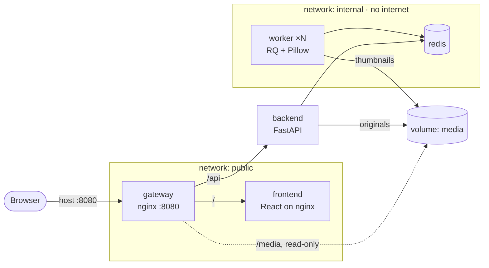

# Thumbnail Factory

A small app built to learn Docker and Docker Compose. You upload an image, a background worker makes
thumbnails, and the page shows each job moving from `queued` to `processing` to `done`.

The app is deliberately simple. Each of the five containers exists because the app needs it, so each
Docker concept shows up for a real reason: multi-stage builds, named volumes, networks, healthchecks,
restart policies, scaling, and dev/prod Compose files.

## Architecture



| Service | What it does |
|---------|--------------|
| `gateway` | nginx, the only container with a published port. It routes `/api` to the backend, `/` to the frontend, and serves thumbnails straight from the `media` volume. |
| `frontend` | The React app. In production-like mode it's built static files served by nginx; in dev mode it's the Vite dev server. |
| `backend` | FastAPI. It validates uploads, saves originals, queues jobs, and reports status. It's the only service on both networks. |
| `worker` | An RQ worker that takes jobs off the queue and writes WebP thumbnails at 128, 256, and 512 px. Scale it with `--scale worker=N`. |
| `redis` | The job queue and job status store. |

Design details are in [specs/design.md](specs/design.md), requirements in
[specs/requirements.md](specs/requirements.md), and the build plan in [specs/tasks.md](specs/tasks.md).

## Quick start

You need Docker with Compose v2 (Docker Desktop includes both). Nothing else: Python and Node run
inside the containers.

```sh
docker compose up --build
```

Open <http://localhost:8080> and drop in some images.

If port 8080 is already taken, choose another one:

```sh
GATEWAY_PORT=8081 docker compose up --build
```

## Two modes

| | Dev (default) | Production-like |
|---|---|---|
| Command | `docker compose up` | `docker compose -f compose.yml up` |
| Files | `compose.yml` + `compose.override.yml` (loaded automatically) | `compose.yml` only |
| Frontend | Vite dev server; React edits appear in the browser without a reload | Built static files on nginx |
| Backend | `uvicorn --reload` on your bind-mounted source | Code baked into the image |
| Worker | `watchfiles` restarts `rq worker` when code changes | `rq worker` |

The smoke test and CI use production-like mode, so they test what actually gets deployed.

## Everyday commands

```sh
docker compose ps                        # what's running, and health status
docker compose logs -f worker            # follow one service's logs
docker compose exec backend sh           # shell inside a container
docker compose exec redis redis-cli      # poke at Redis (keys: job:*, jobs:recent, rq:*)
docker compose up -d --wait              # start in the background; return once healthy
docker compose down                      # stop and remove containers (volumes are kept)
docker compose down -v                   # ...and delete the volumes (all data)
scripts/smoke_test.sh                    # end-to-end check through the gateway
```

## Learning experiments

Each experiment below was run on this stack; the output shown is what actually happened. Start the
stack first with `docker compose up -d --wait`. Commands assume the default port, 8080.

### 1. Scale the workers

```sh
docker compose up -d --scale worker=3
```

Upload 6 images at once. Each job card shows which worker processed it. In our run the 6 jobs were
split 2 per worker across 3 different workers. Three started at once, then the other three, so the
batch took about 4 s instead of 12 s.

**Why it works:** all workers read the same Redis queue, and each job goes to exactly one of them. The
`worker` service has no `container_name` and no published ports, which is what lets Compose run
several copies of it. The name on each card is the container's hostname (its short container ID).

### 2. Kill a worker in the middle of a job

```sh
WORKER_DELAY_SECONDS=30 docker compose up -d --wait   # slow jobs down
# upload an image, wait until its card says "processing", then:
docker compose kill worker
docker compose ps -a worker                           # Exited (137)
```

Keep watching the card. It stays `processing` for about 90 s, then switches to **failed: worker lost**
(94 s in our run).

**Why:** a killed worker can't record that it failed. RQ notices only when the worker's heartbeat
expires, which takes about 90 s. The API checks RQ each time it reports a `processing` job, so the UI
shows the failure soon after that. If it relied on RQ's own cleanup, which workers run every 10
minutes, the job would look stuck for much longer.

**Also notice:** the worker was *not* restarted, even though it has `restart: unless-stopped`. Docker
treats `docker compose kill` as you deliberately stopping the container, the same as
`docker compose stop`. Bring it back with `docker compose up -d`. Compare that with
`docker compose exec worker kill 1`, which makes the process exit on its own: Docker restarts that
container by itself.

**Dev-mode caveat:** in dev mode the container's main process is `watchfiles`, not `rq`. If `rq`
crashes, `watchfiles` keeps running, so Docker still reports the container as `Up` and the restart
policy never applies. Check `docker compose logs worker`. In production-like mode `rq` *is* the main
process, so a crash stops the container and it gets restarted.

### 3. `down` versus `down -v`

```sh
docker compose down && docker compose up -d --wait      # jobs and thumbnails are still there
docker compose down -v && docker compose up -d --wait   # everything is gone
```

In our run: 18 jobs and 69 files survived `down`; after `down -v` there were 0 of each.

**Why:** containers are disposable, and any data they write inside themselves disappears with them.
Uploads live in the `media` named volume and jobs in `redis-data` (Redis also saves its data to disk
there). `down` removes containers and networks but keeps volumes; `-v` deletes the volumes too.

### 4. Network isolation

```sh
docker compose exec gateway nc -zv -w 2 redis 6379     # nc: bad address 'redis'
docker compose exec backend python -c "import redis; print(redis.Redis(host='redis').ping())"   # True
```

**Why:** the gateway and frontend are on the `public` network; Redis and the worker are on `internal`.
Docker's built-in DNS only answers for services on the same network, so from the gateway the name
`redis` doesn't even exist. The backend is on both networks and is the only path between them.
`internal` is also marked `internal: true`, so nothing on it can reach the internet.

Before this split, everything shared one default network and the gateway could connect to Redis,
which has no password.

### 5. Image sizes and multi-stage builds

```sh
docker image ls "thumbnail-factory/*"
docker history thumbnail-factory/backend
```

| Backend image | Unpacked | Download |
|---------------|---------:|---------:|
| Debian `-slim`, one stage | 299 MB | 104 MB |
| Alpine, one stage | 200 MB | 84 MB |
| Alpine, two stages (current) | 117 MB | 36 MB |

The frontend shows the effect even more strongly: its Node build stage is 293 MB, and the image that
ships is 59 MB, of which the app itself is 270 KB.

**Why:** image layers only ever add files. Running `rm` in a later step doesn't shrink the image,
because the earlier layer still contains the file. A multi-stage build installs things in a throwaway
`builder` stage and copies only the result (`COPY --from=builder`) into a fresh image, so the build
tools never become part of what ships. The full breakdown is in
[specs/measurements.md](specs/measurements.md).

### 6. A broken dependency blocks startup

```sh
docker compose down
REDIS_URL=redis://redis:6390/0 docker compose up -d --wait   # wrong port on purpose
docker compose ps -a
```

```
backend    Up 31 seconds (unhealthy)
gateway    Created
redis      Up 32 seconds (healthy)
```

`up --wait` gives up after about 30 s with
`dependency failed to start: container thumbnail-factory-backend-1 is unhealthy`, and the gateway is
never started.

**Why:** the backend's healthcheck calls `/api/health`, which pings Redis. The gateway has
`depends_on: backend: condition: service_healthy`, so it waits for a healthy backend, not just a
running one. Without the condition, the gateway would start straight away and send users errors.
Run `docker compose down && docker compose up -d --wait` to recover.

### 7–8. CI and deployment

Experiments for the CI smoke test and for rolling back a deployment are added in milestones 7 and 9.

## Tests

```sh
cd backend && uv run pytest && uv run ruff check .      # unit tests + lint
cd frontend && npm run lint && npm run build            # lint + type-check + build
scripts/smoke_test.sh                                   # full stack, through the gateway
```

GitHub Actions runs the backend and frontend checks on every push and pull request.
