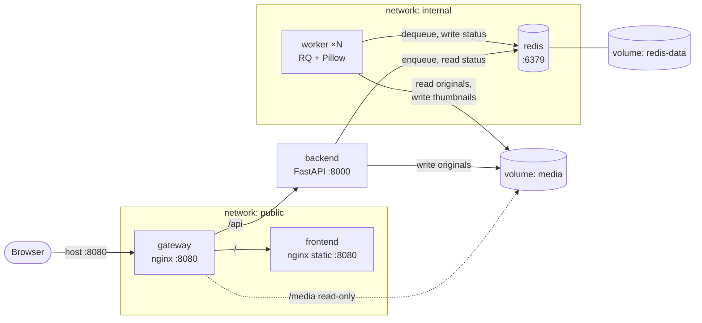
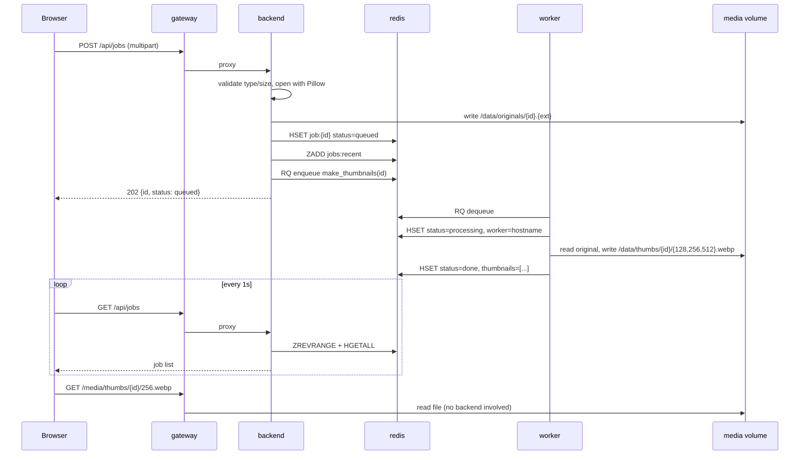
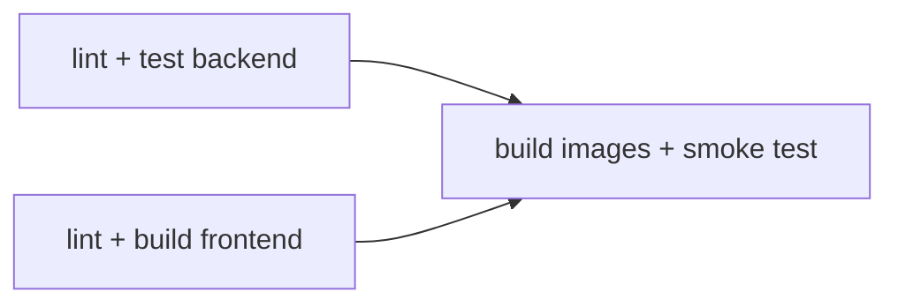
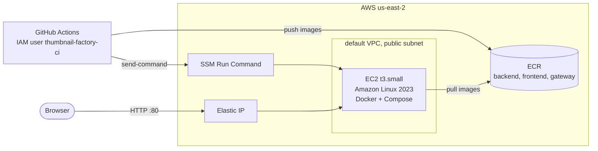

# Thumbnail Factory — Design

Companion to [requirements.md](requirements.md). Requirement IDs (FR*, IR*, CI*, D*) are referenced
where a design choice exists to satisfy them.

## 1. Architecture



`backend` sits on both networks: it is the only bridge between the public-facing tier and Redis (IR3).

### Request flow: upload to thumbnails



## 2. Repository layout

```
thumbnail-factory/
├── compose.yml               # base, production-like stack (builds locally)
├── compose.override.yml      # dev: bind mounts, reload, Vite HMR (auto-loaded)
├── compose.prod.yml          # EC2: ECR images by tag, no build
├── .env.example
├── backend/                  # one image, two services: backend + worker
│   ├── Dockerfile
│   ├── pyproject.toml
│   ├── app/
│   │   ├── config.py         # env-driven settings
│   │   ├── main.py           # FastAPI app and routes
│   │   ├── jobs.py           # job records in Redis
│   │   ├── tasks.py          # RQ task: make_thumbnails
│   │   └── imaging.py        # Pillow resize logic
│   └── tests/
├── frontend/
│   ├── Dockerfile            # stages: deps → dev → build → runtime
│   ├── nginx.conf            # static serving + SPA fallback
│   ├── package.json
│   └── src/
├── gateway/
│   ├── Dockerfile
│   └── templates/default.conf.template
├── infra/                    # AWS CDK app (Python)
├── scripts/
│   ├── smoke_test.sh         # used by CI and locally
│   └── deploy_remote.sh      # runs on the instance via SSM
├── .github/workflows/
│   ├── ci.yml
│   └── deploy.yml
└── specs/
```

## 3. Services

### 3.1 gateway (nginx)

- Image: `nginx-unprivileged` (listens on 8080, runs as non-root; IR12).
- Config is an envsubst template (`/etc/nginx/templates/*.template`, a built-in feature of the
  official image) so the same image routes to either the production frontend or the Vite dev server:

  | Location   | Target                                     | Notes |
  |------------|--------------------------------------------|-------|
  | `/api/`    | `http://backend:8000`                      | `client_max_body_size 10m` → 413 before the backend sees oversize bodies (FR2) |
  | `/media/`  | `alias /data/` on the `media` volume, `:ro` | Long cache headers; thumbnails are immutable per job ID |
  | `/`        | `http://${FRONTEND_UPSTREAM}`              | `frontend:8080` in prod, `frontend:5173` in dev; WebSocket upgrade headers for HMR |

- Uses Docker's embedded DNS (`resolver 127.0.0.11`) with variables in `proxy_pass` so nginx starts even
  if an upstream is temporarily down, and re-resolves when containers are recreated.

### 3.2 frontend (React + Vite + TypeScript)

- Components: `UploadDropzone`, `JobList`, `JobCard`. No state library; `useEffect` polling of
  `GET /api/jobs` every 1 s (FR9).
- `JobCard` shows status, worker hostname (FR8), error, and thumbnails once done (FR10).
- All API calls use relative URLs (`/api/...`), so the frontend never needs to know the backend address.
- Dockerfile stages:
  - `deps`: `npm ci`
  - `dev`: runs `vite --host 0.0.0.0` (target for `compose.override.yml`)
  - `build`: `npm run build`
  - `runtime`: `nginx-unprivileged` + `dist/` only (IR10)

### 3.3 backend (FastAPI)

Routes (all under `/api`):

| Route | Behavior |
|-------|----------|
| `POST /api/jobs` | Validate `Content-Type` ∈ {jpeg, png, webp} and size ≤ 10 MB; open with Pillow and `verify()` to reject non-images; write original; create job record; enqueue; return `202 {id, status}`. Errors → `400`/`413` with `{"detail": "..."}` (FR3). |
| `GET /api/jobs` | 50 most recent jobs, newest first. |
| `GET /api/jobs/{id}` | Single job, or `404`. |
| `GET /api/health` | `200` if Redis `PING` succeeds, else `503`. Used by the Compose healthcheck. |

Job IDs are UUID4 hex strings. The RQ job ID is set equal to the app job ID so the two can be correlated.

Job JSON, as returned by `GET /api/jobs/{id}` and as each element of `GET /api/jobs` (`{"jobs": [...]}`).
Timestamps are ISO 8601 UTC. Fields that don't apply yet are `null`.

```json
{
  "id": "3f2b9c1e8a7d4b6f9e0c1d2a3b4c5d6e",
  "status": "done",
  "filename": "cat.jpg",
  "created_at": "2026-09-26T18:04:11Z",
  "started_at": "2026-09-26T18:04:11Z",
  "finished_at": "2026-09-26T18:04:13Z",
  "worker": "a1b2c3d4e5f6",
  "error": null,
  "thumbnails": [
    {"width": 128, "url": "/media/thumbs/3f2b9c1e8a7d4b6f9e0c1d2a3b4c5d6e/128.webp"},
    {"width": 256, "url": "/media/thumbs/3f2b9c1e8a7d4b6f9e0c1d2a3b4c5d6e/256.webp"},
    {"width": 512, "url": "/media/thumbs/3f2b9c1e8a7d4b6f9e0c1d2a3b4c5d6e/512.webp"}
  ]
}
```

`POST /api/jobs` returns `202` with the same shape (`status: "queued"`, empty `thumbnails`).

### 3.4 worker (RQ)

- Same image as backend; command `rq worker thumbnails --url $REDIS_URL`.
- `make_thumbnails(job_id)`:
  1. Set `status=processing`, `worker=$HOSTNAME`, `started_at`.
  2. Sleep `WORKER_DELAY_SECONDS` (FR7).
  3. For each width in 128, 256, 512: `Image.thumbnail()` preserving aspect ratio; apply EXIF orientation;
     save as WebP to `/data/thumbs/{id}/{width}.webp`. Never upscale.
  4. Set `status=done`, `thumbnails`, `finished_at`.
  5. On exception: set `status=failed`, `error`, then re-raise so RQ also records the failure.
- `$HOSTNAME` defaults to the container ID, which is unique per replica. That is how scaling becomes
  visible in the UI (FR8, IR8).

### 3.5 redis

- `redis:7-alpine` with `--appendonly yes` for durability on the `redis-data` volume (IR6).
- Healthcheck: `redis-cli ping`.
- Not published to the host. For debugging, use `docker compose exec redis redis-cli`.

## 4. Data model

### Redis keys

| Key | Type | Contents |
|-----|------|----------|
| `job:{id}` | hash | `id`, `status`, `filename`, `content_type`, `created_at`, `started_at`, `finished_at`, `worker`, `error`, `thumbnails` (JSON array of `{width, url}`) |
| `jobs:recent` | sorted set | member = job ID, score = `created_at` (epoch seconds). Trimmed to 500 entries on insert. |
| `rq:*` | (RQ internal) | Queue `thumbnails`, RQ job records and registries |

The app's own `job:{id}` hash, not RQ's job record, is the source of truth the API returns. That keeps
the API contract independent of RQ internals.

**Lost workers:** if a worker is killed mid-job (experiment 2), `job:{id}` stays `processing`. RQ
eventually moves the job into its `FailedJobRegistry` once the worker's heartbeat expires. On read, the
API reconciles: a job that is `processing` in our hash but failed or missing in RQ is reported as
`failed` with `error="worker lost"`.

### Media volume layout

```
/data/
├── originals/{id}.{jpg|png|webp}
└── thumbs/{id}/{128,256,512}.webp
```

Thumbnail URL = `/media/thumbs/{id}/{width}.webp`, served by the gateway from `/data/` (IR4, IR5).

## 5. Container images

| Image | Base | Build notes |
|-------|------|-------------|
| `backend` | `python:3.12-alpine` | Builder stage installs deps with `uv` into `/opt/venv`; final stage copies only the venv and `app/`. Runs as `app` (UID 10001). Creates `/data` owned by `app` so a fresh named volume inherits that ownership. |
| `frontend` | `node:24-alpine` → `nginx-unprivileged:alpine` | See §3.2. Node 24 matches the local toolchain that generates `package-lock.json`. |
| `gateway` | `nginx-unprivileged:alpine` | Copies the config template only. |
| `redis` | `redis:7-alpine` | Official image, not built. |

All base images are pulled from the ECR Public mirror of Docker Official Images
(`public.ecr.aws/docker/library/...`, `public.ecr.aws/nginx/nginx-unprivileged`).

ECR Public has rate limits too: unauthenticated pulls are capped at 1 per second per IP (not
adjustable), authenticated at 10 per second, and pulls from EC2 at 10 per second. GitHub-hosted
runners share IPs, so CI can be throttled (`toomanyrequests: Rate exceeded`) by other people's
jobs. CI retries the Redis pull with backoff. Authenticating would raise the limit, but it would
put AWS credentials in pull-request workflows, which D4 deliberately avoids. The EC2 instance pulls
at the higher EC2 rate.

A `.dockerignore` in each build context excludes `node_modules`, `.venv`, tests, and caches.

## 6. Compose

### 6.1 `compose.yml` (base, production-like)

| Service | Build/image | Networks | Volumes | Ports | Health / depends_on |
|---------|-------------|----------|---------|-------|---------------------|
| gateway | `./gateway` | public | `media:/data:ro` | `${GATEWAY_PORT:-8080}:8080` | depends on frontend (started), backend (healthy) |
| frontend | `./frontend` target `runtime` | public | — | — | — |
| backend | `./backend` | public, internal | `media:/data` | — | healthcheck `/api/health`; depends on redis (healthy) |
| worker | `./backend` (same image) | internal | `media:/data` | — | healthcheck `python -m app.worker_health` (registered in Redis and process alive, zombies count as dead); depends on redis (healthy) |
| redis | `redis:7-alpine` | internal | `redis-data:/data` | — | healthcheck `redis-cli ping` |

- `restart: unless-stopped` on every service (IR9).
- The backend healthcheck uses `python -c "urllib.request.urlopen(...)"`, so it doesn't depend on which
  HTTP tools the base image happens to ship.
- The worker has no `container_name` and no published ports, so `--scale worker=3` works (IR8).
- Config comes from `.env`, with defaults inline (`${WORKER_DELAY_SECONDS:-2}`) so the stack also runs
  without a `.env` file (IR11).

### 6.2 `compose.override.yml` (dev; auto-loaded; IR13)

- backend: bind-mount `./backend/app`, command `uvicorn app.main:app --reload`.
- worker: bind-mount `./backend/app`, command `watchfiles "rq worker thumbnails ..." app` to restart on change.
  `watchfiles` is present because it's part of `uvicorn[standard]`. If that extra is ever dropped, add
  `watchfiles` explicitly or the dev worker won't start.
- frontend: `target: dev`, image `thumbnail-factory/frontend-dev` (so the dev build doesn't overwrite the
  production-like `thumbnail-factory/frontend` tag), bind-mount `./frontend`, anonymous volume over `/app/node_modules` so the
  host's copy (if any) doesn't shadow the container's.
- gateway: `FRONTEND_UPSTREAM=frontend:5173`. Vite's HMR client connects to the page's own origin when no
  `server.hmr` port is configured, so its WebSocket goes through the gateway with no Vite config.

`docker compose -f compose.yml up` skips the override (IR14).

### 6.3 `compose.prod.yml` (EC2)

- A standalone file, not an overlay: every service uses
  `image: ${ECR_REGISTRY}/thumbnail-factory/<name>:${IMAGE_TAG}` and has no `build:`.
- gateway publishes `80:8080`.
- Same networks, volumes, healthchecks, and restart policies as `compose.yml`.

## 7. Configuration

| Variable | Default | Used by |
|----------|---------|---------|
| `GATEWAY_PORT` | `8080` | host port for the gateway in `compose.yml`; override when 8080 is taken |
| `REDIS_URL` | `redis://redis:6379/0` | backend, worker |
| `MEDIA_ROOT` | `/data` | backend, worker |
| `MAX_UPLOAD_MB` | `10` | backend |
| `WORKER_DELAY_SECONDS` | `2` | worker |
| `THUMBNAIL_WIDTHS` | `128,256,512` | worker |
| `FRONTEND_UPSTREAM` | `frontend:8080` | gateway |
| `ECR_REGISTRY`, `IMAGE_TAG` | — | `compose.prod.yml` only |

## 8. Testing

| Layer | Tool | Scope |
|-------|------|-------|
| Unit | `pytest` | `imaging.py` (sizes, aspect ratio, no upscale, EXIF orientation); `jobs.py` and API routes against `fakeredis`; task function called directly with RQ's synchronous mode |
| Lint | `ruff`, `oxlint`, `tsc --noEmit` | backend, frontend |
| Integration | `scripts/smoke_test.sh` | Full stack via `compose.yml`: upload `scripts/fixtures/sample.jpg` through the gateway, poll until `done` (timeout 30 s), `GET` one thumbnail and assert `200 image/webp`. Exits non-zero on failure. |

## 9. CI/CD (GitHub Actions)

### 9.1 `ci.yml` — on pull request and push to `main`



- `backend`: set up Python + uv, `ruff check`, `pytest`.
- `frontend`: `npm ci`, `oxlint`, `tsc --noEmit`, `vite build`.
- `smoke`: `docker/bake-action` builds all Compose services with `cache-from/to: type=gha` (CI4), then
  `docker compose -f compose.yml up -d --wait` and `scripts/smoke_test.sh`. `if: failure()` dumps
  `docker compose logs` (CI5).

### 9.2 `deploy.yml`

- Triggers:
  - `workflow_run` of `ci.yml` completing successfully on `main` (CI6).
  - `workflow_dispatch` with an `image_tag` input, for rollback (D8).
- Runs in the `production` GitHub environment (only `main` allowed), which holds:
  - secrets: `AWS_ACCESS_KEY_ID`, `AWS_SECRET_ACCESS_KEY`
  - variables: `AWS_REGION`, `ECR_REGISTRY`, `INSTANCE_ID`, `PUBLIC_URL`
- Steps:
  1. `aws-actions/configure-aws-credentials` with the secrets (D4).
  2. `aws-actions/amazon-ecr-login`.
  3. Build and push `backend`, `frontend`, `gateway` tagged with the commit SHA. This step is skipped on
     rollback, because those images already exist. A following step checks all three tags exist in ECR
     (via `batch-get-image`, which the CI user's pull grant allows), so a mistyped or expired rollback
     SHA fails before touching the instance.
  4. `aws ssm send-command` with `AWS-RunShellScript`. The command payload carries `compose.prod.yml`
     (base64) plus `deploy_remote.sh`, so the Compose file that runs always matches the deployed SHA.
     The instance needs no git checkout.
  5. Poll `aws ssm get-command-invocation` until the command finishes; fail the job on non-zero exit and
     print its output.
  6. `curl` the public URL's `/api/health` as a post-deploy check.
- `deploy_remote.sh` (on the instance):
  1. ECR login using the instance role.
  2. Write `compose.prod.yml` and `.env` (`IMAGE_TAG`, `ECR_REGISTRY`) to `/opt/thumbnail-factory`.
  3. `docker compose pull`, then `up -d --wait --remove-orphans`, then `docker image prune -f`.

## 10. AWS infrastructure (CDK, `infra/`)

One stack, `ThumbnailFactory`, in `us-east-2` (D1, D10).



| Resource | Details |
|----------|---------|
| ECR repositories | `thumbnail-factory/{backend,frontend,gateway}`; lifecycle keeps the last 10 images; `emptyOnDelete` so teardown doesn't fail on non-empty repos (D2). |
| EC2 instance | `t3.small`, Amazon Linux 2023, 20 GiB gp3 encrypted root volume, IMDSv2 required, in the default VPC's public subnet. User data installs Docker and the Compose plugin and enables the Docker service. The SSM agent is preinstalled on AL2023. |
| Elastic IP | Stable public URL across instance stop/start; exported as a stack output. |
| Security group | Inbound TCP 80 from `0.0.0.0/0` only. No port 22 (D5, D6). |
| Instance role | Managed policy `AmazonSSMManagedInstanceCore`, plus ECR pull limited to the three repositories and `ecr:GetAuthorizationToken` (D6). |
| CI IAM user | `thumbnail-factory-ci` with an inline least-privilege policy as listed in D4. Access keys are created outside CDK. |

Stack outputs: `PublicUrl`, `InstanceId`, `EcrRegistry`, `CiUserName`. These map directly to the GitHub
environment variables in §9.2.

Commands: `cdk bootstrap` (once), `cdk deploy`, `cdk destroy` (D7). The `redis-data` and `media` volumes
live on the instance's root disk, so `cdk destroy` deletes all app data. This is intended for a learning
project.

## 11. Key decisions

| Decision | Chosen | Alternative | Why |
|----------|--------|-------------|-----|
| Queue library | RQ | Celery; hand-rolled `BRPOP` | Minimal concepts, Redis-only, readable internals. Celery's broker and result-backend layers add complexity without teaching more Docker. |
| Job state store | App-owned Redis hash | RQ job metadata only | Stable API contract; RQ is an implementation detail. |
| Separate gateway and frontend containers | Yes | One nginx serving both | Shows container-to-container routing; lets dev swap the frontend for Vite without touching the gateway. |
| Status updates | Polling | Redis pub/sub + SSE | Simpler; SSE is a possible extension. |
| Thumbnail format | WebP | Match input format | Smallest output; handles PNG transparency. |
| Deployment target | EC2 + Compose | ECS/Fargate | Keeps Compose as the deployment artifact; see requirements. |
| CI → AWS auth | Scoped IAM user | OIDC | OIDC providers are denied by the project's SCP (D4). |
| Shipping the Compose file | Inline in SSM command | git clone on instance; S3 | No repo credentials on the instance; the file is pinned to the deployed SHA. |
| Base image registry | ECR Public mirror | Docker Hub | Official images without a Docker Hub account. It is *also* rate-limited (1 unauthenticated pull/s per IP), so CI retries pulls; see §5. |
| Backend base image | `python:3.12-alpine` | `python:3.12-slim` (Debian) | All dependencies ship musllinux wheels, so there's no compiling; the full test suite passes on Alpine. The OS layer is 9 MB versus 115 MB (see measurements.md). The cost: musl is less common than glibc, so a future dependency without a musl wheel would need build tools added. |
| Architecture | x86_64 | Graviton (arm64) | No multi-arch builds in CI; `t4g` is a later cost-saving option. |
