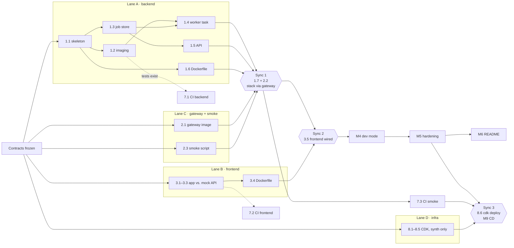

# Thumbnail Factory — Tasks

Implementation plan for [design.md](design.md). Work top to bottom; each milestone ends in a working,
committed state. IDs in brackets reference [requirements.md](requirements.md).

**Deliberate ordering:** milestones 1–4 build a simple, working stack first (single network,
single-stage images, root user). Milestone 5 hardens it. The "before" state is intentional: it gives
experiments 4 and 5 something to compare against. Record the measurements when a task asks for them.

Legend: 🧑 = a step you (the human) must do, because it needs your GitHub/AWS console access.

---

## Parallelization plan

The milestone order above is the **sequential** path. The work can also run in parallel lanes,
because several parts only depend on agreed interfaces, not on each other's code.

### Contracts to freeze first

Lanes can work independently only if these don't change underneath them. They are already defined in
design.md; changing one after the lanes start means a coordinated change across lanes.

| Contract | Defined in | Consumed by |
|----------|-----------|-------------|
| API routes, status codes, and job JSON | design §3.3 | backend, frontend, smoke test |
| URL layout (`/api`, `/media/thumbs/{id}/{w}.webp`, `/`) | design §3.1, §4 | gateway, frontend, backend |
| Compose service names and ports (`backend:8000`, `frontend:8080`/`5173`, `redis:6379`) | design §6.1 | gateway, compose files, CI |
| Image names (`thumbnail-factory/{backend,frontend,gateway}`) | design §6.3, §10 | CDK, deploy workflow |
| Env vars | design §7 | all |

### Dependency graph



### Lanes

| Lane | Tasks | Can start | Blocked until | Owns (only this lane edits) |
|------|-------|-----------|---------------|------------------------------|
| **A · backend** | 1.1–1.6, later 5.2, 5.3 | immediately | — | `backend/` |
| **B · frontend** | 3.1–3.4 | immediately; develop against a mock API (Vite dev server `proxy` to a small fixture server, or hardcoded fixtures matching the job JSON) | — | `frontend/` |
| **C · gateway + smoke** | 2.1, 2.3 | immediately | Sync 1 to verify against the real stack | `gateway/`, `scripts/` |
| **D · infra** | 8.1–8.5 | immediately | Sync 3 for `cdk deploy` (see cost note) | `infra/` |
| **E · CI** | 7.1 → 7.2 → 7.3 | once 1.2 has tests | 7.3 needs Sync 1 | `.github/workflows/` |
| **Integration** | 1.7, 2.2, 3.5, M4, 5.1, 5.4–5.6, M6, M9 | at sync points | — | `compose*.yml`, `.env.example`, `README.md` |

### Sync points

1. **Sync 1: stack runs through the gateway.** Merge lanes A and C; do 1.7 and 2.2. Gate:
   `smoke_test.sh` passes.
2. **Sync 2: frontend wired in.** Merge lane B; do 3.5. Gate: manual browser check (3.5's "Done when").
3. **Sync 3: deploy.** Requires M5 (hardened images are what get shipped), 7.3 green, and lane D synth
   clean. Then run 8.6 and M9.

Milestones 4 → 5 → 6 stay sequential. They are small, and almost every task in them edits
`compose.yml`, so parallelizing them would mostly create merge conflicts.

### Conflict hotspots

- **`compose.yml`** is touched by 1.7, 2.2, 3.5, M4, and most of M5. Only the integration step edits it,
  and always at a sync point.
- **`backend/Dockerfile`** is touched by 1.6, 5.2, and 5.3. It stays in lane A, done in order.
- **`README.md`** is written in M6. Lanes put notes in their PR descriptions instead of editing it.

### Critical path

`1.1 → 1.3 → 1.5 → Sync 1 → Sync 2 → M4 → M5 → Sync 3 → M9`

Lanes B, C, D, and E are all off the critical path, so parallelizing them shortens the calendar by
roughly the length of M3 + M7 + M8. The backend lane and the sequential hardening work set the pace.

### Mechanics

- One git branch (and worktree) per lane: `lane/backend`, `lane/frontend`, `lane/gateway`,
  `lane/infra`, `lane/ci`. Lanes push their branches freely; `main` only changes at sync points.
- Before milestone 7's branch protection exists, merge lanes locally at sync points and push `main`.
  After it exists, each lane opens a PR.
- **Cost note (lane D):** `cdk deploy` starts the instance billing (~$0.65/day from credits). Keep lane D at
  `cdk synth` until Sync 3, unless you want to explore the instance early.

### Recommendation

This is a solo learning project, so full five-lane parallelism isn't the best trade-off. Building the
pieces in order is part of what you're learning, and five branches mean a lot of merge bookkeeping.

A good middle ground is **two lanes**:

1. **App lane** (sequential milestones 1–6) with CI jobs 7.1/7.2 added as soon as tests exist, so every
   later change is checked.
2. **Infra lane** (8.1–8.5 at synth level), which shares no files with the app.

Use full parallelism if the goal is speed (for example, delegating lanes to Claude subagents in separate
worktrees) rather than learning each step hands-on.

---

## Milestone 1 — Backend, Redis, and worker via Compose

Goal: submit a job with `curl` and watch a worker produce thumbnails. No gateway or frontend yet.

- [x] **1.1 Backend project skeleton**
  - `backend/pyproject.toml` with deps: `fastapi`, `uvicorn[standard]`, `python-multipart`, `redis`, `rq`,
    `pillow`; dev deps: `pytest`, `fakeredis`, `httpx`, `ruff`.
  - `app/config.py`: settings read from env with the defaults in design §7.
  - Done when: `uv sync` succeeds and `ruff check` passes.

- [x] **1.2 Imaging** [FR5]
  - `app/imaging.py`: `make_thumbnails(src_path, dest_dir, widths) -> list[{width, path}]`. Apply EXIF
    orientation, preserve aspect ratio, never upscale, output WebP.
  - Tests: output widths, aspect ratio, no upscaling of small images, EXIF-rotated input, PNG with alpha.
  - Done when: `pytest tests/test_imaging.py` passes.

- [x] **1.3 Job store** [FR4, FR6]
  - `app/jobs.py`: `create`, `get`, `list_recent(limit=50)`, `update`, following the Redis layout in
    design §4 (`job:{id}` hash, `jobs:recent` sorted set trimmed to 500).
  - Tests against `fakeredis`.
  - Done when: tests pass.

- [x] **1.4 Worker task** [FR5–FR8]
  - `app/tasks.py`: `make_thumbnails(job_id)` implementing the status transitions in design §3.4,
    including `WORKER_DELAY_SECONDS` and `worker=$HOSTNAME`. On failure, record `failed` + error, then re-raise.
  - Tests: success path and failure path (corrupt image), run synchronously.
  - Done when: tests pass.

- [x] **1.5 API** [FR1–FR4, API table]
  - `app/main.py`: `POST /api/jobs`, `GET /api/jobs`, `GET /api/jobs/{id}`, `GET /api/health` as in
    design §3.3, including the "worker lost" reconciliation from design §4.
  - Tests with `TestClient` + `fakeredis`: valid upload → 202; wrong type → 400; oversized → 413;
    non-image bytes with an image content type → 400; unknown ID → 404; health with Redis down → 503.
  - Done when: tests pass.

- [x] **1.6 Backend Dockerfile (single-stage, on purpose)**
  - `FROM public.ecr.aws/docker/library/python:3.12-alpine`, install deps, copy `app/`, default command
    `uvicorn app.main:app --host 0.0.0.0 --port 8000`. Runs as root for now.
  - `.dockerignore`.
  - 📏 Record `docker image ls` size for the backend image in `specs/measurements.md`.
  - Done when: `docker build ./backend` succeeds.

- [x] **1.7 `compose.yml` v1**
  - Services: `redis`, `backend` (publish `8000:8000` temporarily, for curl), `worker` (same build,
    `rq worker thumbnails` command). Default network only. `media` and `redis-data` volumes.
  - `.env.example` with all variables from design §7.
  - Done when:
    ```sh
    docker compose up --build -d
    curl -F file=@scripts/fixtures/sample.jpg localhost:8000/api/jobs      # → 202 {id}
    curl localhost:8000/api/jobs/<id>                                       # → done after ~2 s
    docker compose exec worker ls /data/thumbs/<id>                         # → 128/256/512.webp
    ```

- [x] **1.8 Commit & push** — "Milestone 1: backend, worker, Redis under Compose"

---

## Milestone 2 — Gateway and shared media volume

Goal: one entry point on `:8080`; thumbnails served by nginx directly from the volume.

- [x] **2.1 Gateway image** [IR4]
  - `gateway/Dockerfile` from `public.ecr.aws/nginx/nginx-unprivileged:alpine`.
  - `gateway/templates/default.conf.template` with routes `/api/` → backend and `/media/` → `alias /data/`.
    Include `client_max_body_size 10m`, `resolver 127.0.0.11`, and variables in `proxy_pass`, per design
    §3.1. Leave `/` returning a placeholder until milestone 3.
- [x] **2.2 Wire into Compose** [IR2, IR5]
  - Add `gateway` publishing `8080:8080`, `media:/data:ro`. Remove the backend's published port.
  - Done when: the curl flow from 1.7 works via `localhost:8080/api/...`, and
    `curl -I localhost:8080/media/thumbs/<id>/256.webp` returns `200` with `Content-Type: image/webp`.
  - Done when: an 11 MB upload returns `413` from nginx (check the gateway logs; the backend log should
    show no request).
- [x] **2.3 Smoke test script** [CI5]
  - `scripts/smoke_test.sh` + `scripts/fixtures/sample.jpg`, per design §8. `BASE_URL` defaults to
    `http://localhost:8080`.
  - Done when: it exits 0 against the running stack and exits non-zero with the worker stopped
    (`docker compose stop worker`).
- [x] **2.4 Commit & push**

---

## Milestone 3 — Frontend

Goal: upload and watch jobs in the browser at `http://localhost:8080`.

- [ ] **3.1 Scaffold** — Vite React-TS app in `frontend/`, ESLint config, `npm run lint` and `npm run build` scripts.
- [ ] **3.2 Upload** [FR1–FR3] — `UploadDropzone`: file picker + drag-and-drop, client-side type/size
  hint, and the server error shown inline.
- [ ] **3.3 Jobs view** [FR8–FR10] — `JobList` polling `/api/jobs` every 1 s; `JobCard` showing status
  badge, worker hostname, error, and thumbnails.
- [ ] **3.4 Frontend Dockerfile** [IR10] — stages `deps`, `dev`, `build`, `runtime` per design §3.2;
  `frontend/nginx.conf` with SPA fallback on 8080.
- [ ] **3.5 Wire into Compose** — add `frontend`; gateway `/` → `${FRONTEND_UPSTREAM}` (default `frontend:8080`).
  - Done when: in a browser, upload 3 images, see each go queued → processing → done, and see thumbnails render.
- [ ] **3.6 Commit & push**

---

## Milestone 4 — Dev mode with hot reload

- [ ] **4.1 `compose.override.yml`** [IR13] — per design §6.2 (bind mounts, `uvicorn --reload`,
  `watchfiles` for the worker, Vite `dev` target, `FRONTEND_UPSTREAM=frontend:5173`, anonymous
  `node_modules` volume). Add `watchfiles` to the backend dev deps.
  - Done when:
    - editing a React component updates the browser without a reload (HMR through the gateway);
    - editing `app/main.py` restarts uvicorn (visible in the logs);
    - editing `app/tasks.py` restarts the worker.
- [ ] **4.2 Prod-like run still works** [IR14] — `docker compose -f compose.yml up --build` serves the
  built frontend, and `scripts/smoke_test.sh` passes.
- [ ] **4.3 Commit & push**

---

## Milestone 5 — Hardening

Each task changes one thing, so you can observe its effect.

- [ ] **5.1 Split networks** [IR3] — `public` (gateway, frontend, backend) and `internal` (backend, worker, redis).
  - Done when: `docker compose exec gateway nc -zv redis 6379` fails (name does not resolve), and the
    smoke test still passes.
- [x] **5.2 Multi-stage backend image** [IR10] _(done early, after the Alpine switch)_ — builder stage with `uv` → `/opt/venv`; minimal Alpine runtime stage.
  - 📏 Record the new image size next to the milestone 1 size in `specs/measurements.md`.
- [ ] **5.3 Non-root** [IR12] — `app` user (UID 10001) in the backend image (Alpine: BusyBox
  `addgroup -S`/`adduser -S -D -H`, not Debian's `useradd`); `/data` created and owned
  by `app` in the image.
  - Done when: `docker compose exec backend id` shows UID 10001. On a fresh volume
    (`docker compose down -v && up`), uploads still work. Note in `measurements.md` what happens if you
    skip pre-creating `/data`.
- [ ] **5.4 Healthchecks and startup order** [IR7] — healthchecks on redis and backend;
  `depends_on: condition: service_healthy` as in the design §6.1 table.
  - Done when: `docker compose up --wait` returns only once all services are healthy, and
    `docker compose ps` shows `(healthy)`.
- [ ] **5.5 Restart policies** [IR9] — `restart: unless-stopped` on all services.
  - Done when: `docker compose exec worker kill 1` → the worker comes back by itself.
- [ ] **5.6 Scaling check** [IR8] — `docker compose up -d --scale worker=3`, upload 6 images, and see ≥2
  distinct worker hostnames in the UI.
- [ ] **5.7 Commit & push**

---

## Milestone 6 — README and learning experiments

- [ ] **6.1 README** — what the project is, the architecture diagram (from design §1), quick start,
  dev vs. prod-like modes, service overview, and useful commands (`logs -f`, `exec`, `redis-cli`, `ps`).
- [ ] **6.2 Experiments 1–6** — one section each with the command, what to observe, and why. Run each one
  and confirm the README's description matches what actually happens (especially #2, the worker-lost path).
- [ ] **6.3 Commit & push**

---

## Milestone 7 — CI

- [ ] **7.1 `ci.yml`: backend job** [CI1–CI3] — uv, `ruff check`, `pytest`.
- [ ] **7.2 `ci.yml`: frontend job** [CI2] — `npm ci`, lint, `tsc --noEmit`, build.
- [ ] **7.3 `ci.yml`: smoke job** [CI4, CI5] — `docker/bake-action` with the GHA cache, then
  `compose up -d --wait`, `smoke_test.sh`, and logs on failure.
  - Done when: the workflow is green on a PR. A second run shows cache hits (much shorter build step).
- [ ] **7.4 Branch protection** 🧑 — in GitHub settings, require the CI checks on `main`.
- [ ] **7.5 Experiment 7** — open a PR that breaks `tasks.py`; confirm the smoke job fails and prints
  logs. Add the section to the README.
- [ ] **7.6 Commit & push** (via PR, now that branch protection is on)

---

## Milestone 8 — AWS infrastructure (CDK)

Before starting: 🧑 confirm `us-east-2` is the project's selected Region (AWS Settings → View all
projects → Overview → Additional Info → Region). Consider a $5 budget alert in the Billing and Cost
Management console.

- [ ] **8.1 CDK app skeleton** [D7] — `infra/` Python CDK app, one stack `ThumbnailFactory`, env pinned
  to the account and `us-east-2`. `cdk synth` succeeds.
- [ ] **8.2 ECR repositories** [D2] — three repos with a lifecycle of 10 images, `emptyOnDelete`, and
  `RemovalPolicy.DESTROY`.
- [ ] **8.3 Networking and instance** [D1, D5, D6, D10] — default VPC lookup, security group (TCP 80
  only), instance role (SSM core + scoped ECR pull), `t3.small` AL2023 instance with IMDSv2, a 20 GiB
  encrypted gp3 root volume, user data installing Docker + the Compose plugin, and an Elastic IP.
- [ ] **8.4 CI IAM user** [D4] — `thumbnail-factory-ci` with the least-privilege inline policy; no keys in CDK.
- [ ] **8.5 Outputs** — `PublicUrl`, `InstanceId`, `EcrRegistry`, `CiUserName`.
- [ ] **8.6 Deploy** — `cdk bootstrap` (once) and `cdk deploy`.
  - Done when: the instance appears in the SSM Fleet Manager as online, and
    `aws ssm send-command ... "docker version && docker compose version"` succeeds.
- [ ] **8.7 CI credentials** 🧑 (I'll give exact commands):
  - `aws iam create-access-key --user-name thumbnail-factory-ci`
  - Create a GitHub environment `production` limited to `main`. Add the two secrets and the variables
    `AWS_REGION`, `ECR_REGISTRY`, `INSTANCE_ID`.
- [ ] **8.8 Commit & push**

---

## Milestone 9 — Continuous deployment

- [ ] **9.1 `compose.prod.yml`** [D3] — per design §6.3.
- [ ] **9.2 `scripts/deploy_remote.sh`** — per design §9.2.
- [ ] **9.3 `deploy.yml`** [D4, D5, D8, CI6] — triggers, `production` environment, build/push (skipped on
  rollback), SSM send-command with inline files, invocation polling, and a post-deploy health check.
- [ ] **9.4 First deploy** — merge to `main`.
  - Done when: `http://<PublicUrl>` serves the app, and an upload completes end-to-end on EC2.
- [ ] **9.5 Experiment 8 (rollback)** — `workflow_dispatch` with a previous SHA; confirm the old version is served.
- [ ] **9.6 README: deployment section** [D9] — architecture, one-time setup, cost estimate
  (~$20/month from credits for `t3.small`), key rotation, `cdk destroy` teardown and data-loss note.
- [ ] **9.7 Commit & push**

---

## After milestone 9

- Decide whether to keep the stack running (it uses about $20/month of the free plan credits) or run
  `cdk destroy`.
- Possible extensions: SSE instead of polling; Postgres for job history; Graviton (`t4g`) with multi-arch
  builds; HTTPS via CloudFront in front of the instance.
